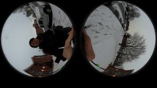

# ThetaS-video-remap
 ➡️ 

Generate maps for [ffmpeg](http://ffmpeg.org) to convert of spherical video from the dual-full frame fish-eye images to equirectangular video.

Adapted from the example given for ffmpeg's [`RemapFilter`](https://trac.ffmpeg.org/wiki/RemapFilter), with support added for video captured with Ricoh Theta S devices.


## Guide

### Building

1. Install ffmpeg, (make sure it's a recent version)
2. Checkout the source of this repository
3. Build: `$ gcc projection.c -lm -o project

### Running

#### Create maps `xmap.pgm` and `ymap.pgm` for use with videos from Theta S devices:

```
$ ./project -x xmap.pgm -y ymap.pgm -h 960 -w 960 -c 1920 -r 960 -m theta --verbose
```

 

This creates two ASCII encoded [PGM files](https://en.wikipedia.org/wiki/Netpbm_format#PGM_example) which act as a lookup table for ffmpeg to remap the video.

#### Apply the maps to the video `R0014696.MP4`:

```
$ ffmpeg -i R0014696.MP4 -i xmap.pgm -i ymap.pgm -q 0 -lavfi "format=pix_fmts=rgb24,remap" remapped.mp4
```

#### Tag for upload

If you want to upload your video to youtube, make sure you encoded it as a .mp4, and use [this](https://github.com/google/spatial-media) tool from google. On linux, you can install `python-tk` and use the gui, or use it via command line. The instructions say to run `python spatialmedia` but this results in an error, replace `spatialmedia` with `__main__.py` and it works.

```
python __main__.py -i remapped.mp4 remapped_injected.mp4
```
Your file is now ready for YouTube/etc.
